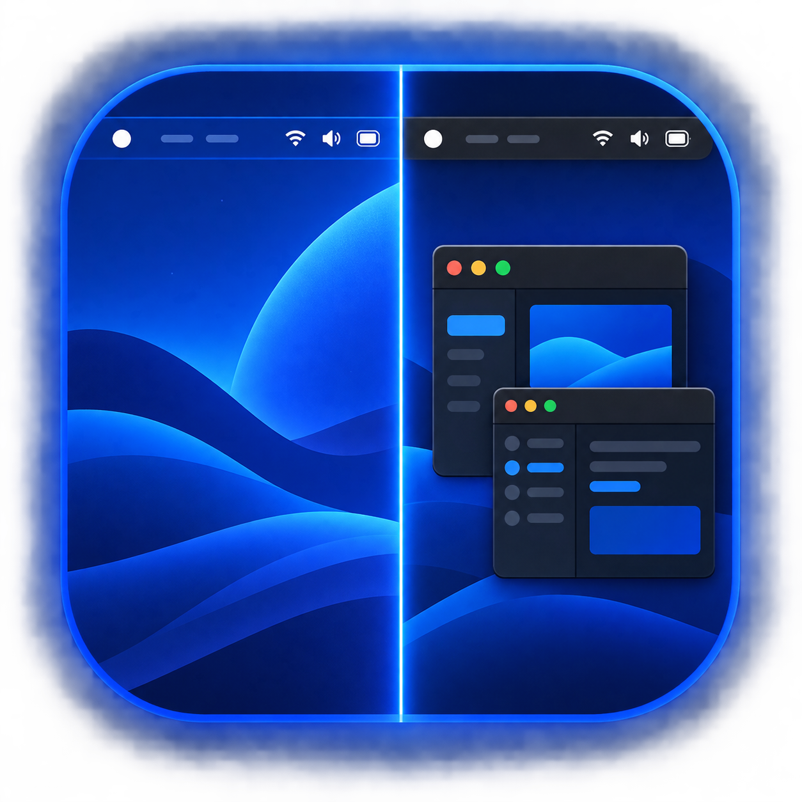

<p align="center">
  
</p>

<h1 align="center">Clear Bar</h1>

<p align="center">
  Adaptive transparency for the Omarchy status bar.
</p>

<p align="center">
  <a href="#install">Install</a> · <a href="#how-it-works">How it works</a> · <a href="#remove">Remove</a>
</p>

Clear Bar is a drop-in Omarchy bar that becomes transparent whenever the active workspace is empty and restores its normal opaque appearance whenever windows are present. It retains the stock widgets, layout, icons, and interactions while listening directly to Hyprland's event socket—there is no polling, configuration rewrite, or shell reload in the hot path.

Clear Bar takes inspiration from [TranslucentTB](https://github.com/TranslucentTB/TranslucentTB), one of the most polished examples of adaptive taskbar transparency on Windows, reimagined for Omarchy and Hyprland.

## Highlights

- Transparent on an empty workspace; opaque when you are working.
- Preserves Omarchy's built-in layout, icons, widgets, and interactions.
- Leaves the screensaver completely unobstructed, with no visible bar surface or input zone.
- Uses a self-contained Omarchy bar plugin—no manual scripts or autostart configuration.
- Restores the normal opaque bar automatically when disabled or removed.

## Install

```bash
omarchy plugin add https://github.com/Ayumad/omarchy-clear-bar.git --enable
```

The install command selects Clear Bar as the active bar immediately. Open an empty workspace to see the transparent bar; opening a window restores the normal opaque bar.

### Upgrading from Clear Bar 1.x

Omarchy 4 sandboxes service plugins from the live bar. Clear Bar 2.0 follows the supported model by becoming the active bar itself. Remove the old service release, then install 2.0:

```bash
omarchy plugin remove io.github.ayumad.clear-bar --yes
omarchy plugin add https://github.com/Ayumad/omarchy-clear-bar.git --enable
```

## How it works

Hyprland publishes workspace and window changes through its event socket. Clear Bar listens to that stream, reads the active workspace's window count, and updates its own live bar surface directly:

| Active workspace | Bar appearance |
| --- | --- |
| Empty | Transparent |
| One or more windows | Opaque |
| Screensaver active | Completely hidden |

When transparent, the bar keeps your current theme's normal text color for reliable, immediate rendering. This intentionally avoids Omarchy's slower wallpaper-specific contrast probe.

## Requirements

- Omarchy Quattro 4.0.3 or newer.
- Hyprland, `hyprctl`, and `socat` (all present in a standard Omarchy session).

## Remove

```bash
omarchy plugin disable io.github.ayumad.clear-bar
omarchy plugin remove io.github.ayumad.clear-bar --yes
```

Disabling the plugin returns the bar to its normal opaque state.

## Privacy and security

Clear Bar makes no network requests, collects no data, and does not alter Hyprland configuration. It reads Hyprland's local event socket and controls only its own in-memory bar opacity. Installing it selects Clear Bar as the active Omarchy bar, as expected for a `bar` plugin.

## Development

```bash
omarchy plugin validate .
```

## License

MIT. See [LICENSE](LICENSE).
